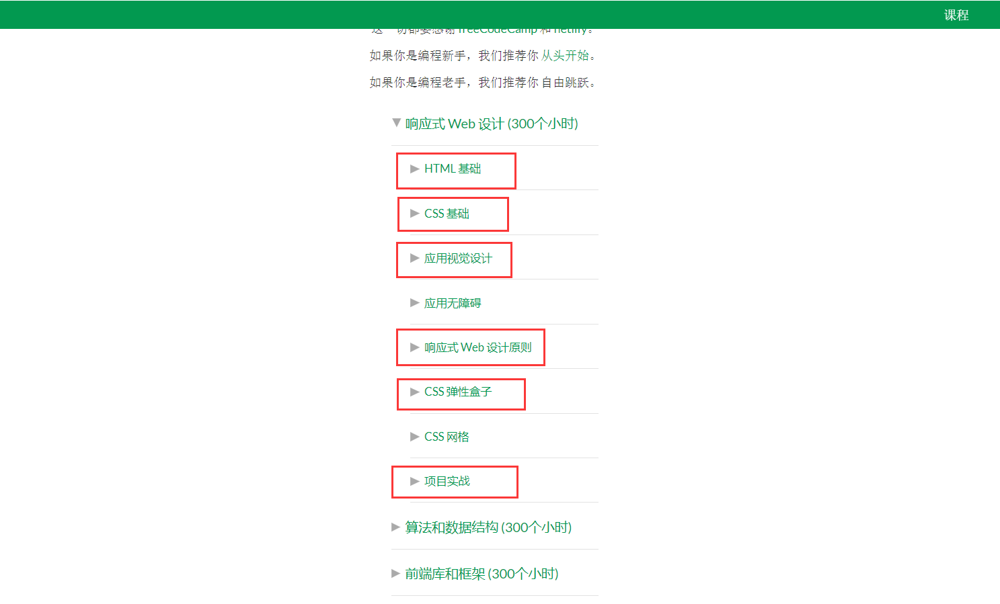

# HTML & CSS

在上次任务中，大家学习了 Git 与 Github 的基本操作，完成了预备阶段的学习任务，接下来我们将正式开始进入前端学习。

## 任务目标

- 掌握常用的 HTML 标签
- 掌握常用的 CSS 属性
- 掌握`flex`布局

## 任务截止时间 11.22

## 任务内容

- [学习HTML基础](https://learn.freecodecamp.one/)
- [学习CSS基础](https://learn.freecodecamp.one/)
- [应用视觉设计](https://learn.freecodecamp.one/)
- [响应式web原则](https://learn.freecodecamp.one/)
- [CSS弹性盒子](https://learn.freecodecamp.one/)
- [项目实战](https://learn.freecodecamp.one/)

- 项目实战完成第一项和第二项，有余力的完成第三项

## 其他学习资源

- [HTML和CSS相关教程](https://www.imooc.com/learn/9)
- [MDN中文文档](https://developer.mozilla.org/zh-CN/)
- 其他(比如bi站视频等)

## 任务要求

- [提交地址](https://github.com/TECHF5VE/TechMap-Works/tree/master/2020-Autumn/Frontend/Task-2)
- 在[CodePen](https://codepen.io/)创建账号，完成上述项目
- 提交任务时，需要每完成一个项目提交一次，[例](https://github.com/TECHF5VE/TechMap-Works/tree/master/2020-Autumn/Frontend/Task-2/hamono)

## 其他

遇到问题，独立思考，解决不了的欢迎提问
