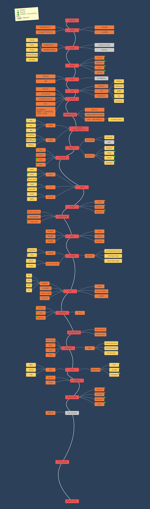

# 2021秋季 前端考核任务

## 准备阶段

1. [Git & Markdown](./task_01/README.md) **截止时间：11.08**

---

## 基础阶段

1. [HTML & CSS](./task_02/README.md) **截止时间: 11.22**

推荐资料：

- [JavaScript 标准参考教程](https://javascript.ruanyifeng.com/)

- [ES6 入门教程](https://es6.ruanyifeng.com/)

推荐书籍：

- JavaScript权威指南（第七版）

- 写给大家看的设计书（第四版）

推荐课程：

- [百度前端技术学院](http://ife.baidu.com/)

- [FreeCodeCamp](https://learn.freecodecamp.one/)

- [ObjTube（就是下面的学习路线图）](https://objtube.github.io/front-end-roadmap/#/)

学习线路推荐：

- 中文版：https://objtube.github.io/front-end-roadmap/#/

- 英文版：https://roadmap.sh/frontend

