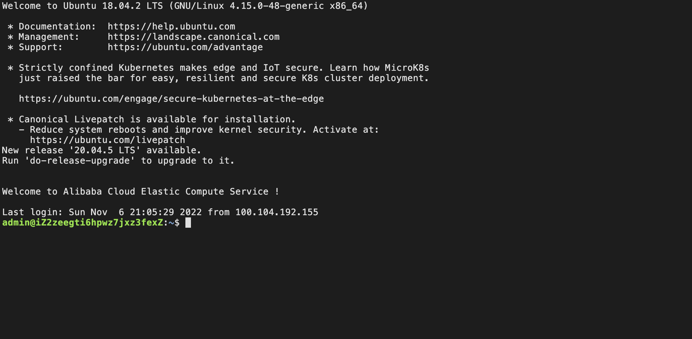
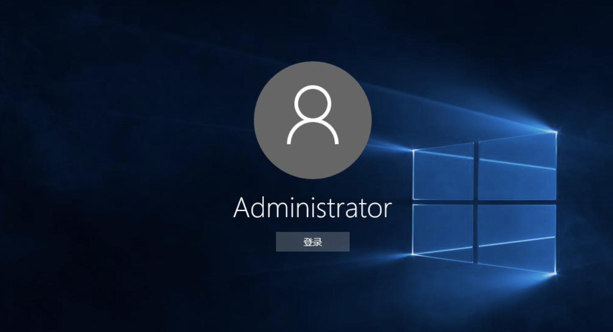
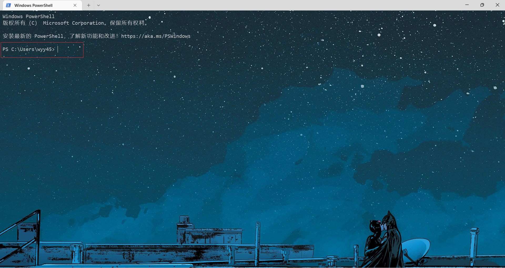
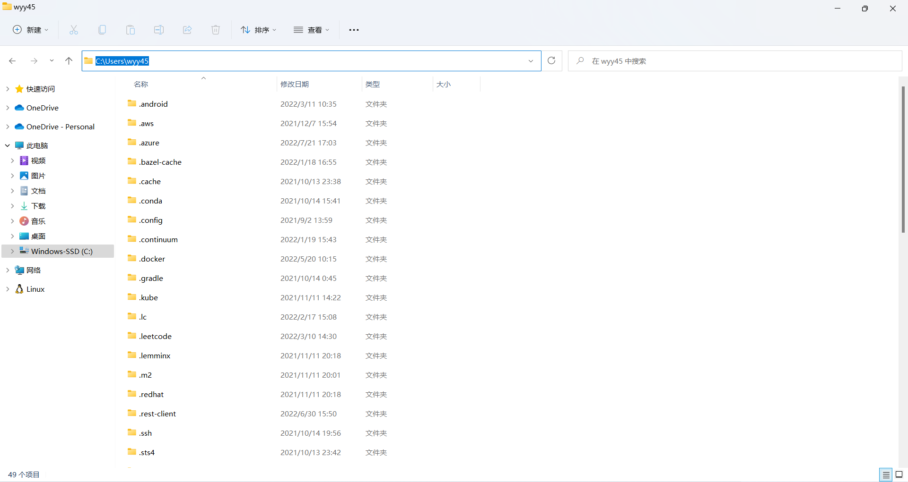
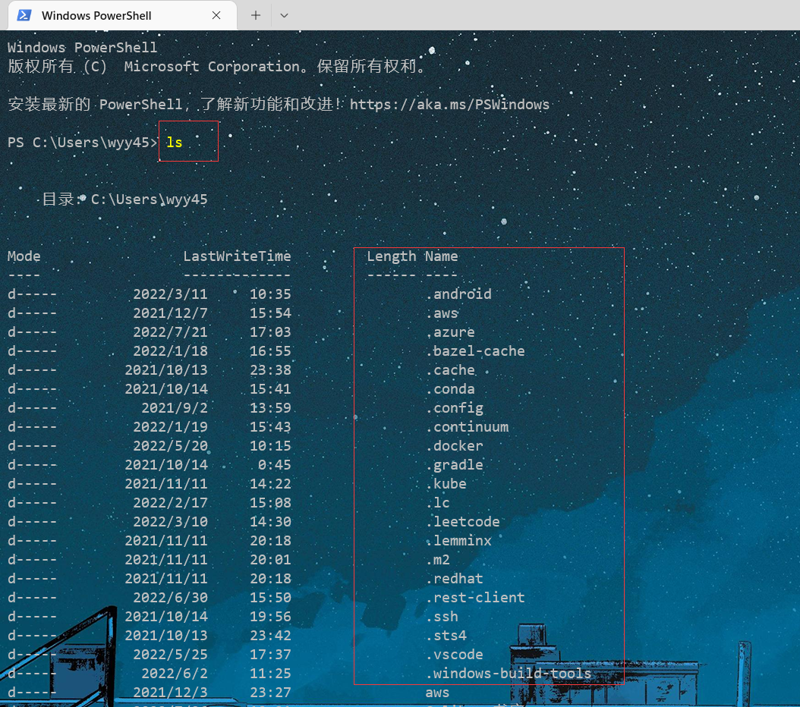

# GUI与命令行

## 一

首先，我们现在正在使用的操作系统（苹果的macOS，微软的windows7\10\11，应该没有人用windowsXP/2007了吧？）都是有```图形界面（Graphical User Interface，简称GUI）```的，这个应该不难理解。这个事情的具体表现就是：当你开机之后，你看见的不是黑白的界面，只有字母，还有一个闪动的光标，而是一个漂亮的界面，可能是你设置背景，要求你输入密码登录。所以我们可以简单地区分下```命令行```和```GUI```：你看见的只有字母没有图形的界面就是命令行界面，有图像能鼠标随便乱点的就是GUI界面（不一定很准确，只是有助于你理解）  
  
  

OK，既然我们现在用的都是图形界面了，那命令行界面去哪里了，我们还能使用吗？那当然是可以的，如果你是windows的电脑，可以试着按 ```win + S``` 打开搜索界面，在搜索框输入 ```powershell``` 或者 ```命令提示符（后续教程基于powershell，建议不要使用命令提示符）``` ,点击之后看看弹出来的框，怎么样，是不是非常像上面的命令行界面？（为了方便后面的学习，建议windows同学们下载一个windows terminal，用windows terminal来替代以后的命令行操作。下载方法： 在上面搜索框中输入商店，打开微软商店， 在商店里面搜索windows terminal下载安装即可）

（如果是macOS同学，打开 ```终端``` app即可）

## 二

对于同一台电脑，比如你正在使用的windows10电脑，这个命令行界面和图形界面之间有什么关系呢？计算机从最早的纸片打孔发展到现在，“图形”这个东西肯定是从无到有的（事实上命令行界面也是），我们可以粗略地认为：```计算机本来的样子其实是命令行界面的样子，随着显示技术的发展为这个命令行披上了一层漂亮的皮，这层皮就是精美的图形界面，它让计算机变得好看又好用```  
我们先选择性地忽视电影音频之类的东西，只考虑文本文件，想象一个动作：你知道你的电脑 D盘的docs文件夹下面有一个a.txt文本文件，如正常使用的话，你会怎么操作？大概是双击我的电脑，然后选择D盘，双击docs文件夹，然后找到这个a.txt文件，双击打开。  
那既然图形界面可以做到：``切换目录``，``打开文件``两个动作，那我用命令行界面是不是也可以？  
打开命令行界面，可以看看前面的路径，这和图形界面上的路径是一样的，说明我们当前在`C:\Users\wyy45`这个路径下。
  
  

如果我们想查看我们这个路径下有什么文件怎么办呢？可以尝试敲命令 `ls` ，然后回车，就可以看到当前目录下的文件了，这里可以对比着图形界面里的文件看看。  
  

如果想切换到其他目录呢？命令行界面肯定是不如图形界面那种鼠标点点点要简单，需要使用命令 `cd`,比如有一个test文件夹在当前目录下，使用`cd test`，此时命令行界面就进到了test文件夹里面。这里建议多尝试尝试，新建文件夹，删除文件，切换到上层目录，这些操作该怎么办呢？搜索引擎查查看，然后敲一敲

``这里没有花篇幅解释cd ls这些命令的含义，以及还有哪些常用命令，建议自己多查查看尝试尝试，遇到不知道的操作（新建文件夹）->搜索查询（打开浏览器search： windows命令行如何新建文件夹？）->查到之后试用一下（mkdir test）-> 试用OK记一下留个印象``

总结一下上面说的东西，意思就是：命令行界面可以像图形界面一样，打开文件，切换目录，进行各种操作，``我们在图形界面进行的各种操作，其实就是对计算机发送一条条cd ls mkdir 之类的命令，计算机根据我们的命令做出对应的反应``。

## 三

我们为什么要学习命令行界面？因为作为程序员，我们与计算机对话的方式其实是一条条的``命令``，我们需要理解，现在我们现在与计算机的所有操作其实都是被翻译成了一条条的命令，传达给计算机，比如刷手机的时候，我们的拇指在屏幕上左划右划，可以被翻译成命令``slide left/right``，我们经常输入账号密码登录，登录这个动作可以被翻译成``login username password``。  
计算机其实就是没有感情的命令接收执行机，收到命令->执行命令->返回结果。  
有了这个基础，我们再进行下一步：编程。

## 课后习题

1. 电脑卡的时候我常常点开任务管理器，查看现在的内存占用情况，查看cpu占用，命令行下面我该使用什么命令查看内存和cpu资源呢？(只要能看到CPU或者内存相关的任何内容都可以，答案不做限制)
2. 我目前的命令行在 `c:\user\temp\cat`目录下，我要切换至`c:\user`目录下的`foo`文件夹里面，请问我应该怎么敲命令？
3. 如果当前路径下面有一个`a.txt`文件，我怎么在命令行界面打开文件，并且编辑它呢?

请把答案私发我QQ或者发送至我的邮箱。