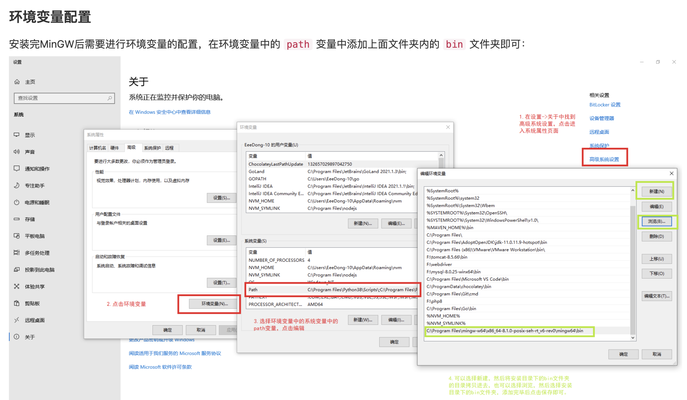
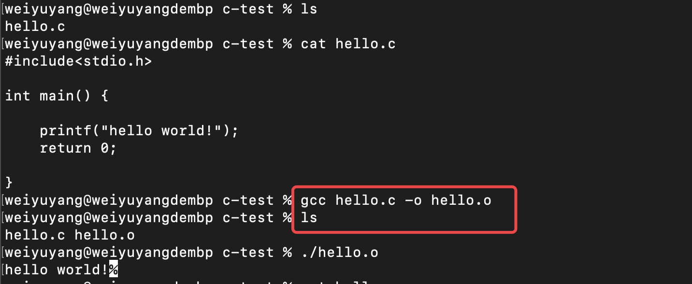

# 环境与程序，编程语言

## 前言

先从上一节的内容说起，上节课的作业里面，第一个问题是在命令行查看cpu，有同学回复我的命令是`win mic` + `cpu get *`, 也有同学回复我 `sysctl machdep.cpu`,还有别的一些答案。这个题目出的比较宽泛，没有规定需要查看cpu的具体什么东西，只要能看到与cpu相关的东西都算正确。  
大家手上应该都不太会有多台电脑，多个系统，我先补充一个前提条件：`不同的系统下的命令（大概率）是不一样的`。比如在linux下查看当前正在运行的任务以及所占的资源，可以用`top`这个命令，但是你在Windows的命令提示符下敲这个命令，就会报错，因为windows不认识这个命令。这个行为类似于现实中对德国人说广东话一样，“语言不通”。  
那我们有没有办法让操作系统学会新的命令呢？答案肯定是有的，实现方式也是多种多样的，比如我上面说的`top`命令，如果使用powershell的同学可以发现，其实Windows也认识这个命令，并且效果和Linux上使用是一样的，同样的命令还有`ls`等等。具体怎么实现的这里不详细说，大概有两种方式：

+ 第一种是“起别名”，比如windows系统下一个命令叫`time`，而linux下面叫`now`，假设这两个命令的功能是相同的，我希望在windows下面敲`now`的时候显示时间，那我给`time`起个别名，叫`now`就可以了【这个过程类似于单词替换，本身就有这个命令，但是新增了一个同义词，powershell对linux命令的支持基本就是这种做法】
+ 第二种是给系统新增一个命令，这个实现就有点复杂了，这个效果类似于：假设我的系统连`time`这个命令都没有，我希望新增一个`now`命令，这时候起别名不管用了。那我需要编写一个命令，这个命令本质是一个`函数(function)`,这个命令的作用是`获取当前时间`，并且告诉操作系统这个函数的`用法`（当我敲now的时候，你要执行这个函数）。【这个过程类似于学习，从无到有】

## 一、环境

说完上面的知识，我们进入今天的主题：`环境`。这是个略微有点抽象的概念，如果你刚进入大学接触编程的话，你的第一门课C语言编程，老师可能会让你下载一个VC++或者visual studio，然后教你如何新建一个项目，新建一个c文件，然后写下hello world，然后单击运行，OK，你的第一个程序运行结束了。  
我们把这个编译到执行过程**假想**成一堆`命令`，它应该是下面这个样子（假设文件名字叫hello.c）：

+ 编译 当前目录下 hello.c 生成文件名 hello.o
+ 执行 当前目录下 hello.o

上面这个流程看上去很平常，但是有几个问题在里面：

1. 众所周知，计算机只认识`01010101`这种二进制，那我们最后执行的程序是怎么转换成二进制，让计算机识别到的呢？（编译器）
2. 我单机运行的那一瞬间，发生了什么事情（先触发了编译，生成一个.o文件，然后执行这个文件）
3. 我的电脑为什么装了VS或者VC++之后就能执行C代码了，既然计算机就是个命令接收执行器，那我能不能在命令行里面做这件事情？
4. 这个世界上有这么多编程语言（python，ruby，go，java，rust，lua），我的电脑要怎么认识它们？

第一第二个问题的答案我已经写在括号里面了，我们从第三个问题开始。第三问的结论当然是可以的，不过如果你是用的vs或者vc++这种`IDE(Integrated Development Environment,集成环境)`，那需要额外做一些`配置`才行。  
这里第一次出现了`环境`这个词，只不过前面多了两个字：集成。集成我们可以理解为“一套”什么东西，比如我们吃饭用的碗筷，可能是个套装，里面的碗和筷子，都属于`一个环境`，用我自己的话来解释：`环境`就是`赋予你某种能力的工具`。比如碗，赋予了你装载食物的能力，筷子，赋予了你夹取食物的能力，他们合在一起，你可以用来`吃饭`。  
那IDE为我们提供了哪些环境呢？首先是 `敲代码` 的环境，一个图形界面，可以像其他文本编辑器一样编辑文字（拿IDE当然可以写txt啦，不止可以敲代码），然后是 `编译` 的环境，点一个按钮就可以实现编译，最后是 `执行` 的环境，可以执行你刚才编译好的文件。他们合在一起，你可以完成 `写C程序` 这件事情。  
所以我们不使用IDE，而是在命令行界面进行C语言编程的话，我们同样需要提供上述对应的环境，我们安装一个编译器[GCC](https://sourceforge.net/projects/mingw/files/MinGW/)(点击链接可以进入下载页面不清楚怎么安装的同学可以看看[教程](https://www.w3cschool.cn/c/install-mingw.html))
在我提供的教程页面里，可以看到有一步很关键的，叫做`环境变量配置`，如果不配置的话我们会发现安装了也没办法使用编译命令，**接下来是本章的一个重点内容**。  
计算机认识的`命令`，可以理解为一张单词表，`ls`，`top`，`编译`，`执行`这些单词如果计算机认识，它就知道该做什么。我们现在为计算机添加了`编译`的环境，相当于在单词表上面新增加了一个单词`compile`，但是，并不是写在计算机原本的这张单词表上的，而是新增了一张单词表。如果计算机依旧只在原来的单词表上检索，那永远找不到`compile`这个单词。`编辑环境变量`这个操作相当于告诉计算机：**我新增了一张单词表，单词表放在某个路径下，记得去这张单词表上找找看有没有compile这个单词**。
  
装好了编译器之后，我们就可以在命令行尝试写一个hello world啦，这个过程与IDE上编写是相同的,下面是我给出的示例，`cat hello.c` 查看了下我编写好的文件，`gcc hello.c -o hello.o`这个命令看着是不是有点熟悉？跟上面我们假想的: `编译 当前目录下 hello.c 生成文件名 hello.o`是不是一样？最后`./hello.o`执行编译好的文件，可以看到输出了hello world。
  

到这里，本节内容就结束了，总结一下，`环境`就是赋予我们执行某件事情的能力，我们如果需要让我们的电脑认识某种语言，需要给它相应的`环境`,配置环境变量，让计算机能认识它。具体的环境需要如何安装，每一门语言的官网都有教学，如果不会配置环境变量，可以直接在搜索引擎搜索`xxx安装以及环境配置`，举例子：[Node.js 环境的安装以及配置](https://cloud.tencent.com/developer/article/1572591)

## 二、程序和编程语言

### 程序

最抽象的地方终于说完了，接下来的内容要稍微轻松一点了。  
我们之前一直在说`命令`，前面也有提到过命令本质上就是一个函数，那我们详细说一说这个部分：我们为什么要写程序？  
其实就是我们为了用计算机实现某件事情（比如加法运算），希望下达指令给计算机的时候（输入命令 add 1 1），计算机能根据我们的指令（1 `+` 1），返回符合我们预期的结果（返回 2）。所以，我们可以简单地认为，编程，或者说写程序，就是在构建一条条命令。

```typescript
// 你不需要关心这是什么语言编写的,这只是一个伪代码示例
// 你能看懂这是个叫做add的函数（或者说命令），接收了a和b两个参数
function add(a: number, b:number){
    // 返回了 a 和 b 两个值相加的结果
    return a + b
}
// 我们预期使用这个命令的方式： add(1,1)
// 这个命令应该返回给我们的结果： 2
```

关于程序有个等式： `程序` = `数据结构` + `算法`，这里暂时不去讲解它，我们先简单地认为：`程序就是多个命令（函数）的组合`。  
举个例子，如果我们想实现一个支持加法减法的功能的程序，它大概长什么样子？

```java
// 加法
int add(int a, int b){
    return a + b;
}

// 减法
int minus(int a, int b){
    return a - b;
}

// 把上面两个函数组合起来，根据type区分开
int calculate(int a, int b, String type){
    // 用了个if语句，选择用哪一个方法
    if(type.equals("add")){
        return add(a, b);
    }else if(type.equals("minus")){
        return minus(a, b);
    }
}

// 如果是加法，我们的使用方法： calculate(1,2,"add")
// 如果是减法，我们的使用方法： calculate(1,2,"minus")
```

上面示例的函数中，我们用一个`if`语句，和一个新的函数，就把两个命令（函数，以后就不说命令了）组合在了一起。以上，就是最基础的理论，程序的构成。

### 编程语言

既然编程是干什么已经说完了，接下来说一说编程语言。我不想讨论什么编译型解释型这种概念，我只想教你如何快速上手学会一门新的编程语言，毕竟我觉得大学上课老师在那儿一行一行指着念`if`, `else if`, `while`,`dowhile`,`for`真的是一件很蠢的事情（这里不考虑指针的概念，这东西略微有点复杂）  
假设我们现在准备上手一门全新的语言，我要如何快速写出一个hello world？  
首先当然是编程环境的安装配置，这个是上一节的内容。  
然后参考官网的quick start，新建一个文件，官网文档一般会告诉你文件的后缀名是啥(.c,.java,.js,.py等等)。  
接着尝试编译，执行，或者直接执行，看到输出hello world，完美，结束！[参考： Rust语言起步](https://www.rust-lang.org/learn/get-started)  
当然不可能这么简单啦，这算个毛的入门，好歹需要能拿这门语言写点分支条件循环吧？然后再尝试尝试这门语言不同于别的语言的地方。  

### 语言的共性

现在的语言脱离不了的共性就是一些基础的东西，比如： `类型`，`结构`。  
类型：可以分为`基础类型`和`高级对象类型`，基础类型概括地说就是两种：`数字`和`字符`,很多静态类型的语言会在这个基础上细分很多种基础类型出来，比如java，数字可以分为整型和浮点型，整型又能分成`int`,`long`,`short'`等等（go，c之类的语言可以分出更多种，32位64位等等），浮点型能分成单精度和双精度浮点，字符就是`char`一种；但是javascript语法略微不同，可以简单区分为`Number`和`String`两种类型（js也是可以细分成整数，浮点等等的）。`高级类型`往往是简单类型的组合，专业点说术语叫“封装”（包装），比如C++里面的`string`，Java里面的`String(在java里面，只有基础类型是小写字母，所以我们能看出来String不属于基础类型)`，是字符数组的扩展，更多地一些高级类型还有`Map`,`Set`等等，这部分就有些语言功能多，提供的高级类型就会多，有些语言可能就没有，比如Java的优先队列`PriorityQueue`，在Nodejs里面就没有原生的实现。利用这些高级类型可以帮我们快速实现一些操作。  
结构： 结构部分就是`分支`,`条件`,`循环`三大将了，应该没有语言能绕开这三个结构。  
分支就是`if`，`else`这种选择一条路走的，不同语言可能不一定用相同的单词，比如shell使用的是 `if`,`elif`,`then`,`else`。  
条件很好理解，if(a > b)，括号里面的就是条件，如何判断 `大于`,`小于`，`等于（==）`，`存在（exists，includes）`，`非（!）`，`与(&&)`，`或(||)`，具体的语法是什么样的，这些就是条件，上了两个月的C语言的同学应该知道C语言中这些符号是什么，比如Java就是和C++符号类似的，但是python中我们可以看到, `not`表示非， `or`, `and`表示或和与，`in`表示存不存在于数组中，javascript还支持`===`这种符号来判断相等。条件的结构是相似的，只是关键字不相同。  
循环就是`for`，`while`这种结构，对每个元素做相同的事情的时候使用的操作，很多语言对这些循环结构都有很好的支持，比如`for...in`,`for...of`,`foreach`等等语法，本质都是循环结构。  
通过以上的共性，应该已经足够我们来使用新语言写一点小东西了（比如写leetcode算法题），我们在学习一门新的编程语言的时候，总是绕不开这些东西，至于熟悉一门语言，则需要花时间去多使用这门语言，了解它们的一些`语法特性`，`高级用法`，以及熟悉这门语言的一些常用函数。  
总结一下：我们如果想要快速上手一门语言，首先是安装它的环境，然后是尝试学习它的基础类型，了解它的`结构`（分支、条件、循环）相关的语法，接着就可以开始愉快地乱写了～  

## 课后练习

1. 从（C#,Java,Ruby,Rust,Node.js,Go,Kotlin,或者其它你感兴趣的语言）中挑选一门编程语言，安装它的环境，并且尝试在命令行or编辑器中用这门语言编写一个hello world。
2. 根据你上面选择的语言回答：
   1. 你选择的这门语言有哪些基础变量类型？
   2. 这门语言的分支，条件，循环分别有哪些语法？有什么你觉得特别的语法？或者不同于C，C++的语法？
3. 你应该接触过C或者C++了，你知道C++最近几年有什么新增的语法么（C++11, C++14, C++17, 或者最新的，随便举一个例子即可，不管你会不会用这个语法）
   1. 或者你想说别的你熟悉的语言也可以

### 补充

1. 对于网慢打不开github的同学，建议配一个VPN，虽然不太合法，但是有助于你学习，糟糕的网络环境总是能影响你的操作
2. 如果想尝试使用Linux系统进行编程（相信我，你做什么都绕不开linux环境，越早尝试越好），有两种方法，第一种是下载vmware虚拟机，第二种我个人比较推荐，现在windows支持WSL2[链接：安装WSL2](https://learn.microsoft.com/zh-cn/windows/wsl/install)，通过这种方式也能安装一个虚拟的Linux系统，好处是不需要配复杂的网络啥的，相对来说简单一点
3. 建议学着看英文资料，这是你获取一手知识的唯一方法。
