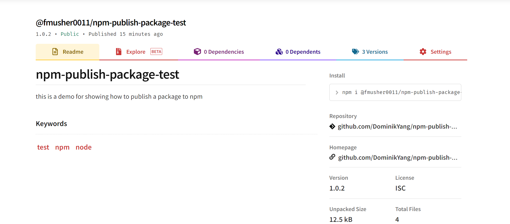
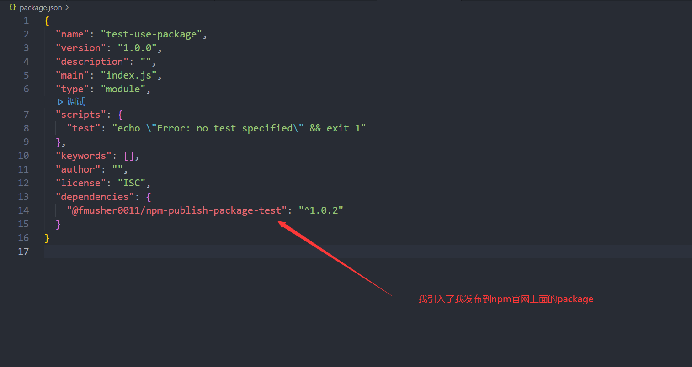
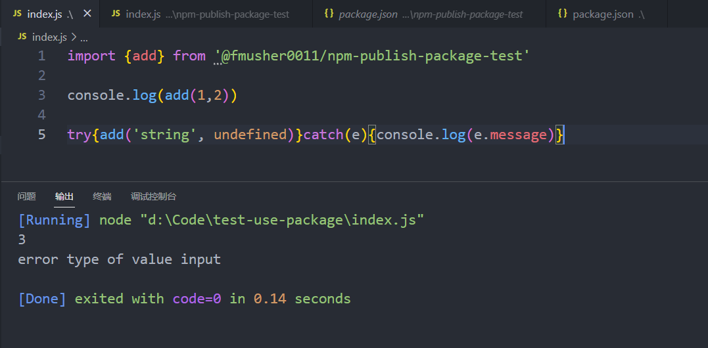

# 包管理器与Github

## 零

这一章是入门篇最后一章，本章主要讲述的内容只有一个主题：`协作`。  
在前一章里，我们简单地介绍了`命令`以及`编程语言基础`，跨度到`协作`，其实还是有一点距离的，毕竟只有基础的语法知识，不具备算法以及基础的一些面向对象，设计模式，网络编程等知识，只是空写着hello world还有最简单的一些小函数，我们现在写的这些东西离一个可以提供给大家使用的`功能`还是有很远的距离。但是学习算法，网络等知识是一个漫长而且枯燥的过程，我的计划是放在之后的后端考核正式的task部分，以一个个任务的方式来带大家了解这些知识。  
我想先带大家了解一些其它的东西，一方面可以提升大家的兴趣（像大学老师一样指着代码一行一行念，盯着个破概念重复无数遍真的很无聊），另一方面也方便我们之后的任务安排。

首先两个问题：

1. 我们写好了一个程序之后，如果别的同学想复用我们的代码，或者我们写好了一个功能之后，想提供给别人用，我们要怎么操作？
2. 假设现在大学老师布置了一个大作业，需要你设计一个xx系统，三个同学一组完成，你和你的组员们商量每一个人写一个函数，三个人的代码合起来之后，就是一份完整的程序，请问你们准备如何协作呢？

## 一

先说第一个问题，这其实是我们在任何编程阶段都会遇到的问题：如果有别人实现了的东西能给我们用就好了。但是我们怎么把别人写好的代码用到自己的代码里面呢？现阶段最通用的分享方式其实是`package`，从字面意思看就是包装的意思。大概的流程就是：`我写好了某个项目->我用某种工具，将这个项目打成某种格式的包-> 我将这个包发布到某个平台上->其他人可以通过这个平台获取到我分享的包`

+ 这里说的`项目`，你可以简单地认为`项目`其实就是一个文件夹，包含了你所写的代码
+ 这个`包`可以理解成压缩包，压缩包也有各种格式，比如.zip .7z，打包就相当于把你的代码文件夹弄成一个压缩包
+ 发布到某个平台，别人可以通过某种方式获取，这个接下来详细说

这里我们模拟下这个过程：
首先，我写好了一个项目，这个项目是使用nodejs写的，使用的包管理工具是npm（语言级别的包管理程序有很多，node的npm，python的pip，java的gradle和maven，它们的使用原理都是一样的）。这个项目只有一个文件index.js，并且只有一个add函数,我将它发布到了npm官网上，旁边还能看到仓库（repository）信息，点开就能看见我发布的程序源代码，还有安装这个包的npm命令

之后，我就可以在新的项目里面引用，并且使用它了

具体到nodejs这门语言的包管理，我们归纳一下，过程就是：写代码，发布代码到npm，利用npm引入已经发布到npm官网上面的包。这个过程在其它语言也是类似的，只是用了不同的包管理工具，C++这类语言略微有些不同，这里先不深入，有兴趣的可以自行去了解。我们介绍包管理这个东西，是为了告诉大家，如何作为一个开发者去享用这个世界上已经取得的成果，如果你有一个想法，其实很多东西没有必要从零开始完全实现，可以通过引入别人写好的代码的方式来为自己节省时间，把主要的精力放在你真正想做的事情上（比如你需要完成一个消息通信工具，但是消息传输为了安全需要加密，你的主要任务是实现消息通信而不是加密，所以完全可以放心地使用市面上成熟的加密算法，没有必要自己浪费时间去钻研加密这件事情，本末倒置）。同时，这也是你向别人分享你的成果的一种方式，你觉得你做了一个有意思的东西，分享出去，别人可以在你的基础上做更多事情。  

当然，事务都是有两面性的，使用别人开发好的东西不总是像我上面说的那样美好，最近很多示例都表明：开源有风险，调包需谨慎。时常有人调用错误的包，被黑客在代码里植入木马，还有的开源包不维护了，导致过时无法使用；开源的东西有很多不确定性在里面，这是我们在使用一项技术、调用一个包的时候经常需要考虑的事情。

## 二

说完了包这个事情，我们再来说一说本科大作业的协作，也就是我上面提的第二个问题。  
我大一的时候就经常做这种作业，最后的解法基本上是两种：一是一个人特别厉害把整个程序都写完了，二是三个人分别写了三份作业，然后几个人在一个QQ群里面疯狂复制粘贴，最后东拼西凑弄成一个程序，这是我大一永远忘不了的傻呗行为。大二之后就再也没有这个问题了，我找到了我靠谱的队友彭哥（也是Tech5成员之一），我们俩一起他写前端我写后端，我们俩多次合作屡试不爽，最终顺利混完了整个大学（祝大家也能找到这样靠谱的队友）。 
我们先补充一下：敲代码和敲word文档有什么区别？仔细想想之前在命令行里面写hello world的过程，整个过程没有任何提示，没有自动换行，自动补全。怎么样，这个过程是不是和敲txt文本文档或者word文档一模一样？所以我们建立一个简单的认知：`写代码就是在写文档，只是这个文档有自己的固定格式`  
那既然代码文件就是一个个文档，我们应该有一套可以管理它的方式：假设有一份文档A，里面有十行，这时候我们在里面新增了一行，另存为文件B。如果我们想知道A对比B新增的是哪一行内容，最简单的办法就是一行一行内容进行比较，就可以找到有区别的这一行了。我们把A文档叫做`版本1`，B文档叫做`版本2`，维护这两份文档之间的关系的工具叫做`版本管理工具`，目前最常用的东西就是一个叫做`git`的工具。 
说到git，很多同学可能会想到github。细心的同学可以发现，这篇文章发布的地址是github.com。我们先把github放到一边，继续说git，git是一个`分布式版本管理工具`，上面我们说了版本管理是一个什么东西，我们维护一份文档的方法其实比上面的过程更简单一点，只需要一份原始文件，然后有一个文件来记录我们这一次的改动记录即可。这个过程有点像银行的存折，我存了一千块，再取了八百块，这一条条存取记录打印到存折上，我们根据这些记录回算就可以知道某一个时刻我们有多少存款了。【git工具的使用这里不会给出详细的演示，文章末尾会给出文档供大家学习参考】  
然后就是GitHub了，GitHub是一个面向开源及私有软件项目的托管平台，因为只支持git作为唯一的版本库格式进行托管，所以叫GitHub。简单来说，它就是一个网盘，你可以把你使用git管理的项目（不只是代码，只要是用git做版本管理的任何文档都可以）上传到github，与全世界的开发者一起协作开发你的项目。【Github具体使用这里也不会介绍，也会提供相应的文档博客给大家参考】  
所以我们来尝试用git+github的方式来写大作业：首先建立一个`仓库(仓库是GitHub里的概念，你可以简单理解为仓库=项目=一个或者多个工程=包含你所有代码的文件夹)`，接着三个人都在这个仓库下面新建自己的文件，写自己的部分的代码，写完之后提交，push到github上，通知其它同学我写好了，你们记得更新下本地的代码即可。通过这种方式，我们就没必要在聊天软件里面复制粘贴代码，出问题了又粘一遍，然后不断重复这种奇怪的事情...

## 总结与接下来

这一章字比较少，因为我把需要实际操作的部分（1.学习使用git 2.学习使用github）的实际操作给省略了，我想把这部分留作这期的课后作业，事实上往年也是这么做的，大家在这个仓库下面可以看到往年的task，第一节其实就是学习使用git和GitHub。这部分内容之前劝退了很多同学，因为很多人连cd，连命令行的概念都不清楚，直接看git的资料确实有点费劲。这一次我在正式学习git之前多分享了一些基础知识，就是希望这个学习曲线能够更平滑一点，希望我准备的这些内容能够帮到各位。  
在这三章内容里面，首先花了很多时间去说`命令`这件事，我们编程其实就是为了给计算机下达一个个指令，我们利用编程语言的条件分支循环，利用一些算法去组合这些命令，就得到了一个个`功能`，许多功能组合在一起就成了一个`程序`了。我们目前只是走了开始的一小步，通过包管理器和GitHub，稍微了解了下在编程的世界里面如何与人协作。在以后的task里面，我们会从基础的数据结构开始，到socket和数据库，再到http网络，一步步带大家了解后端编程。这个过程可能需要几个月甚至一年左右的时间，其中很重要的一件事情其实是`坚持`。这是自学过程中最艰难的一步，坚持，无论前端还是后端都是一样的，尤其是后端相比起所见即所得的前端还要更加枯燥，毕竟我们长时间只能和冰冷黑框框命令行打交道，但是当我们接触到web，学习到并发，学习到现在主流的开发思想，docker，kubernetes，自动化等等技术的时候，相信你会感受到设计出一整套后端解决方案的快乐。以我往年的经验来看，Tech5每年坚持学习到最后的人数十不存一，我也充分地理解，但是还是希望有机会看到这里的你能坚持下去，成为一名优秀的编程者。

## 课后习题&参考资料

1. 新建一个使用git管理的项目，使用Java、Node.js、Go、Python其中一门语言，编写一个add程序，打包发布到对应的包管理平台，告诉我你发布的包是什么，我会install来试用一下
2. 把第一问中你写的项目，上传到GitHub，告诉我上传后的项目地址
3. 给我的GitHub账号[FMusher0011](https://github.com/DominikYang)点一个follow（**不点不算做完作业**）

参考资料：

+ [廖雪峰的 Git 教程](https://www.liaoxuefeng.com/wiki/896043488029600) - git命令行教学
+ [git 在 VS Code中使用](https://zhuanlan.zhihu.com/p/276376558) - git GUI版本教学
+ [git 官方指南 pro git](https://git-scm.com/book/zh/v2) - 官方的总是最好的
+ [一分钟上手GitHub](https://www.githubs.cn/post/github-overview) - Github基本使用教学
+ 第一问可以参考我的demo（ https://github.com/DominikYang/npm-publish-package-test ） 来实现

