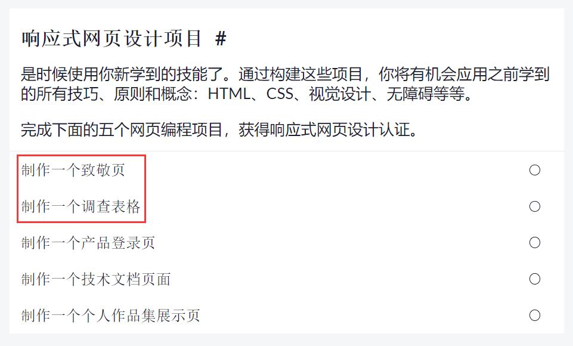

# HTML & CSS

## 引言

从这次任务开始，我们正式进入前端的学习。

**HTML**是一种标记语言，使用成对的标记标签来描述网页，比如``，是网页的骨架

**CSS**是描述应该如何显示HTML元素，是网页的视觉呈现

使用HTML+CSS就能构造一个基础的网页，而现在，利用HTML5和CSS3就能写出非常漂亮和强可交互性的网页

## 任务目标

- 基础：掌握常用的 HTML 标签
- 基础：掌握常用的 CSS 属性
- 附加：掌握`flex`布局
- 附加：了解HTML5和CSS3

## 任务内容

- [基础HTML和HTML5](https://chinese.freecodecamp.org/learn/responsive-web-design/#basic-html-and-html5)
- [基础CSS](https://chinese.freecodecamp.org/learn/responsive-web-design/#basic-css)
- [应用视觉设计](https://chinese.freecodecamp.org/learn/responsive-web-design/#applied-visual-design)
- [响应式网页设计原则](https://chinese.freecodecamp.org/learn/responsive-web-design/#responsive-web-design-principles)
- [CSS弹性盒子](https://chinese.freecodecamp.org/learn/responsive-web-design/#css-flexbox)
- [项目实战：响应式网页设计项目](https://chinese.freecodecamp.org/learn/responsive-web-design/#responsive-web-design-projects)
- 项目实战要求完成第一项和第二项，其他的三个选做（建议看看最后一个制作出来的效果）
  

## 任务要求

- [提交地址](https://github.com/TECHF5VE/TechMap-Works/tree/master/2020-Autumn/Frontend/task_02)
- 在[CodePen](https://codepen.io/)创建账号，完成项目实战（前面的自己也要学学，最好不要跳，有能力的可以直接冲最后一个项目）
- 提交任务时，需要每完成一个项目提交一次，[例](https://github.com/TECHF5VE/TechMap-Works/tree/master/2020-Autumn/Frontend/task_02/hamono)

## 参考资料

### HTML & CSS

菜鸟教程可以边读边做，不要光看，自己动手做一做学起来效果更好

- 必读： [菜鸟教程-HTML](https://www.runoob.com/html/html-tutorial.html)

- 必读： [菜鸟教程-CSS](https://www.runoob.com/css/css-tutorial.html)

- 选读： [W3School-HTML](https://www.w3school.com.cn/html/index.asp)

- 选读： [W3School-CSS](https://www.w3school.com.cn/css/index.asp)

- 测试题： [HTML](https://www.w3school.com.cn/html/html_quiz.asp)

### IDE推荐

- [VSCode](https://code.visualstudio.com/)

### VSCode 插件推荐

- HTML&CSS相关：
  - HTML CSS Support `HTML和CSS语法智能提示`
  - Auto Rename Tag `快速重命名HTML标签`
  - HTML Snippets `超级实用且初级的 H5代码片段以及提示`
  - Path Autocomplete `自动路径补全`

## 结语

有什么不懂的可以优先Google，请尽量学会使用Google搜索（中文&英文），培养独立思考、解决问题的能力

在无法解决时可以提问，在提问时请注意礼貌，谢谢
